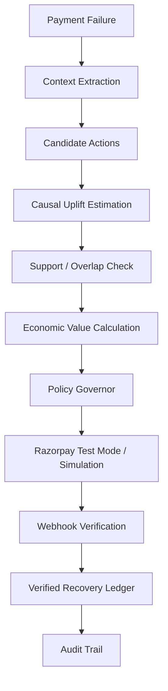
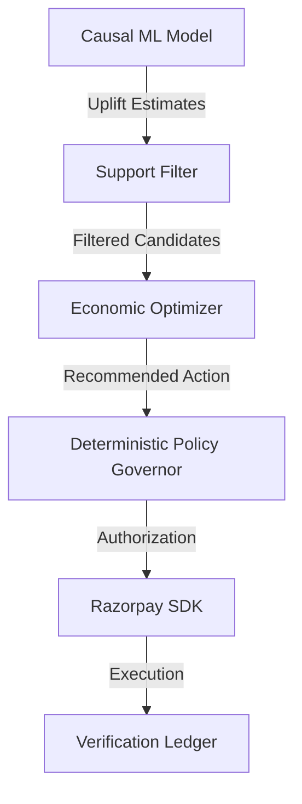
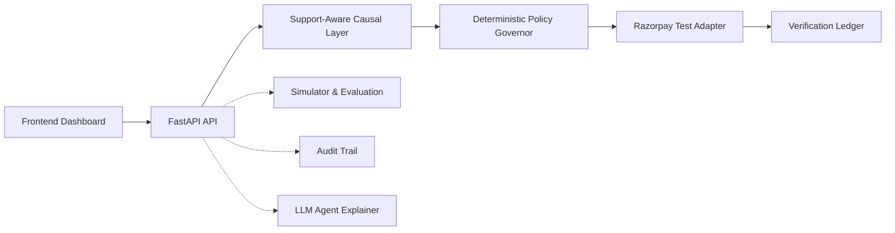

# CausalRecover

Support-aware AI revenue-recovery decision system for failed payments.

[](#)
[](#)

CausalRecover is a support-aware AI revenue-recovery decision system for failed payments. 

The system does not merely predict which payment is likely to recover. It estimates which intervention is likely to create incremental recovery, checks whether historical evidence supports that counterfactual, converts the estimate into expected economic value, and lets a deterministic governor authorize only policy-compliant actions before Razorpay execution. 

When evidence is insufficient, the system abstains.

## Why This Problem Matters

A failed payment is not necessarily lost revenue.

Some payments would recover naturally without any action. Some interventions are harmful and cause unnecessary friction. Some interventions only work for certain customer segments. Compounding this, historical recovery data is policy-biased.

Therefore, raw recovery probability is not the same as incremental intervention value. Acting on raw prediction often results in spending money to "recover" revenue that would have recovered anyway.

## The Core Idea

- **Predictive recovery:** "Who is likely to pay?"
- **Causal recovery:** "What changes because I intervene?"
- **Support-aware causal recovery:** "Do I have enough historical evidence to trust that counterfactual?"

When historical support for a counterfactual is weak, the system formally **abstains** to prevent dangerous extrapolations. This is the core differentiator.

## What CausalRecover Does



## Candidate Interventions

- **NO_ACTION:** Do nothing; allow natural recovery. Used when incremental value is negative or support is too low.
- **RETRY_NOW:** Immediate automated retry. High friction, high immediate cost, effective for soft declines.
- **RETRY_LATER:** Delayed automated retry (e.g., 24 hours later).
- **PAYMENT_MESSAGE:** Send an SMS/Email reminder with a payment link.
- **ALTERNATE_METHOD:** Issue a new Order requesting a different payment instrument.
- **HUMAN_ESCALATION:** Flag for manual support. Highest cost; reserved for high-value transactions.

## How the Causal Layer Works

The system moves beyond correlation by utilizing the potential outcomes framework to estimate heterogeneous treatment effects (CATE). We utilize **T-Learners** and **DR-Learners** (Doubly Robust) to isolate the marginal effect of an intervention against the natural recovery baseline.

Treatment propensity is modeled to adjust for historical assignment bias, and support/overlap constraints are evaluated to ensure regions of the feature space have actually received the treatment historically. (An oracle model is strictly maintained in the simulator exclusively for scientific evaluation).

## Support-Aware Decisioning

A causal ML model can easily produce a mathematically high uplift estimate even when historical support for that intervention in that specific context is incredibly weak. 

Therefore:
`low support → high uncertainty / extrapolation risk → ABSTAIN or fallback`

This is critical for financial automation. For example:
- **Estimated uplift:** +40% (High)
- **Support:** 1% (Very Low)
- **Result:** NO_ACTION / ABSTAIN

## Economic Decision Policy

The final decision is not based on uplift alone. Uplift is translated into an economic policy:

`Expected Incremental Value = (Amount × Estimated Uplift) - Intervention Cost - Friction Cost - Risk Penalty`

- `NO_ACTION` remains continuously available as the baseline.
- Negative expected value automatically produces abstention.
- Deterministic business rules (e.g., max retry limits) can override model recommendations.

## Safety Architecture



**The LLM is not the final authority.** The model and LLMs cannot:
- Change the transaction amount
- Override the Deterministic Policy Governor
- Directly declare a recovery successful
- Bypass webhook verification

## Razorpay Integration

The integration distinguishes strictly between **RAZORPAY TEST MODE** and **SIMULATED MODE**. This project safely uses Razorpay's Python SDK for test-mode execution.

- **Payment Links:** Used for messaging and retry actions.
- **Orders:** Used for alternate method routing.
- **Correlation IDs:** Securely passed through Razorpay `reference_id` or `receipt` fields.
- **Webhook Verification:** A verifiable outcome ledger requires strict webhook signatures and amount-integrity checks.
- **Amount Integrity:** Webhooks must match the exact expected execution amount.

## Architecture



## Dashboard

The CausalRecover Dashboard is the primary product experience, exposing the decision pipeline transparently:

- **Executive Overview:** High-level metrics on net incremental revenue and at-risk totals.
- **Incident Intelligence:** Grouped degradation analysis.
- **Causal Decision Console:** The primary investigation view showing candidate actions, estimated uplift, support bounds, and economic values.
- **Recovery Strategy & Safety:** Monitors governor rule violations.
- **Execution & Audit Trail:** Full chronological trace of every system action and verified webhook.
- **Evaluation & Causal Explainer:** Real-time visibility into the synthetic benchmarks.

## Evaluation Methodology

We do not evaluate this system using simple predictive accuracy (ROC-AUC). We evaluate policy outcomes using:
- Incremental Recovery
- Net Incremental Revenue
- Policy Regret
- Oracle Capture
- Intervention & Abstention Rates

The methodology evaluates the system across five distinct data regimes:
1. RCT (Randomized Control Trial)
2. Mild Observational Bias
3. Strong Observational Bias
4. Severe Positivity Violations
5. Unmeasured Confounding

*Note: These are synthetic evaluation environments utilizing generative Structural Causal Models, NOT Razorpay production results.*

## What We Learned

1. RCT data does not prove causal methods are necessary because treatment assignment is already randomized.
2. Under observational treatment assignment, standard causal models can hallucinate/extrapolate wildly outside historical support.
3. Doubly-Robust (DR) estimation can become mathematically unstable under extreme propensity weights.
4. Support-aware abstention dramatically reduces unsupported, unsafe intervention decisions.
5. Unmeasured confounding remains a causal-identification limitation; we do not claim to solve hidden confounding, but abstention limits the blast radius.

## Security / Failure Engineering

Extensive adversarial testing was performed on the architecture.

**Real Failure Discovered & Fixed:**
Webhook amount verification originally trusted the webhook amount without checking it against the expected execution amount. 
- **Why it mattered:** An adversary could spoof a webhook for ₹1 and clear a ₹10,000 failure.
- **Fix:** The Ledger was hardened to require `expected_amount` enforcement; mismatches are flagged as `VERIFIED_FAILED`.
- **Regression:** Idempotency and amount integrity are now guaranteed in `adapter.py`.

## Validation

**Final Benchmark Results (RCT Regime)**

| Policy | Net Incremental Revenue | Policy Regret | Oracle Capture | Abstention Rate |
|--------|-------------------------|---------------|----------------|-----------------|
| Do Nothing | ₹0 | ₹128,774,151 | 0.00% | 100.00% |
| Naive Recovery | ₹90,348,349 | ₹38,425,803 | 69.62% | 0.00% |
| T-Learner | ₹93,468,294 | ₹35,305,858 | 71.92% | 0.00% |
| **Support-Aware Causal** | **₹92,935,770** | **₹35,838,381** | **71.50%** | **0.00%** |

*(Extracted from the canonical `evaluation/CANONICAL_BENCHMARK.md`. Note: Under Severe Positivity environments, the Support-Aware policy demonstrates heavy abstention to protect against extrapolation).*

## Test Coverage

- **Backend:** 30 `pytest` tests passing.
- **Frontend:** 3 `vitest` tests passing.
- **Frontend Build:** Strict TypeScript compilation passing.

## Demo

The repository contains deterministic cases optimized for a 3-minute demo flow.

1. Open the dashboard.
2. Navigate to **Cases** (Decision Console).
3. Investigate the following verified contexts:
    - `CASE_A_POS_UPLIFT` (Valid causal execution)
    - `CASE_B_NATURAL_TRAP` (Avoids unnecessary spend on natural recovery)
    - `CASE_C_OUT_OF_SUPPORT` (Abstains due to low historical overlap)
    - `CASE_D_POLICY_REJECT` (Agent proposes action; deterministic Governor blocks it)
    - `CASE_E_VERIFIED` (Fully verified execution in the Ledger)

## Quick Start

```powershell
git clone https://github.com/Madhav15s/Rz_track3.git
cd Rz_track3

# Create and activate virtual environment
python -m venv .venv
.venv\Scripts\Activate.ps1

# Install dependencies
pip install -r requirements.txt

# Seed the deterministic demo database
python scripts/seed_demo_db.py

# Start the FastAPI Backend (Port 8000)
python -m uvicorn backend.app.api.main:app --host 127.0.0.1 --port 8000

# Start the Vite Frontend (Port 3000)
cd frontend
npm install
npm run dev
```
