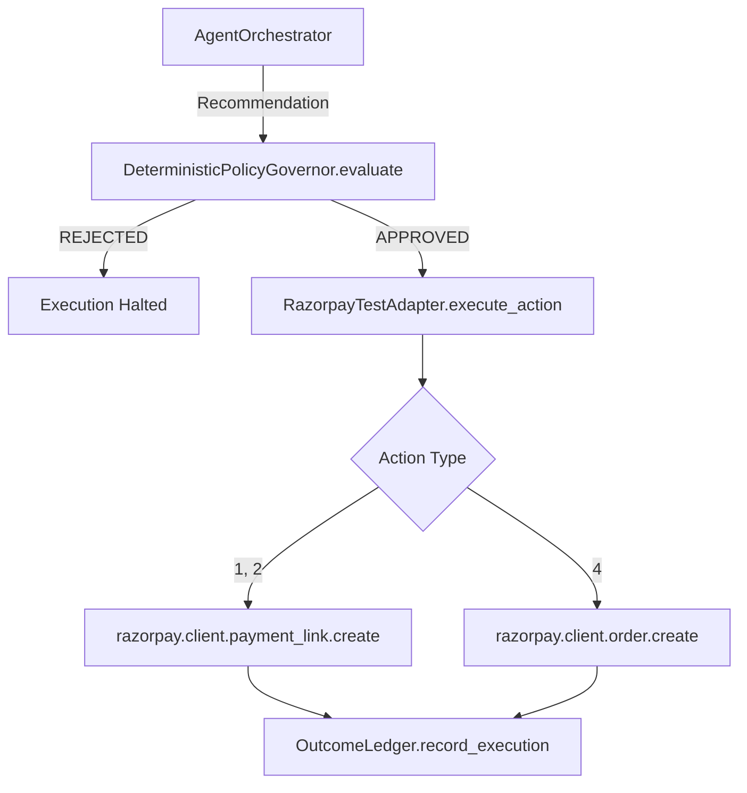
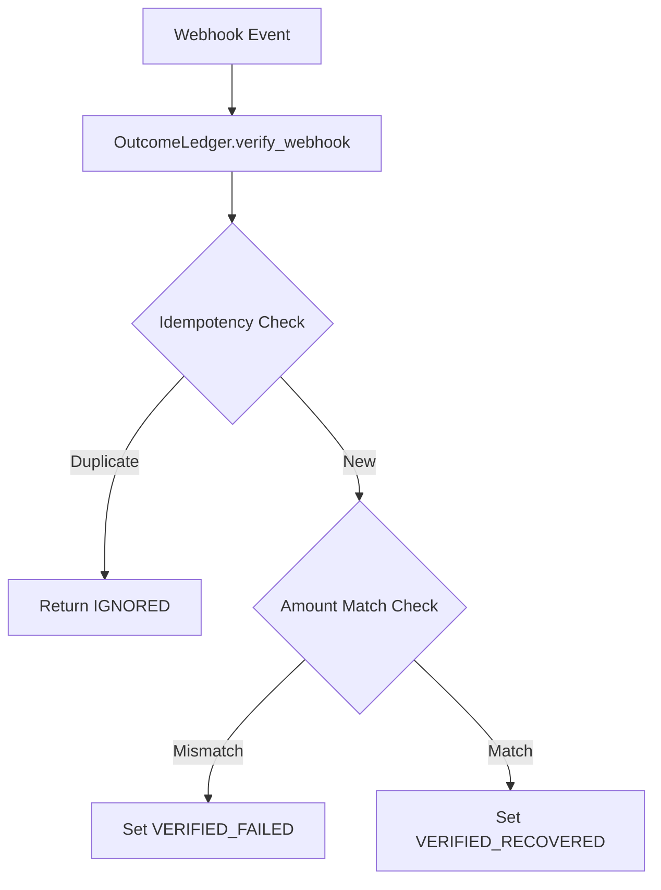

# Execution Call Graph

This graph documents the complete path for all financial mutations in the CausalRecover architecture.

## Primary Execution Path (Production Agent)



## Primary Execution Path (Frontend Demo API)

```mermaid
graph TD
    A[Frontend React UI] -->|POST /api/cases/{case_id}/execute| B[FastAPI `execute_case`]
    B -->|Fetch Case from DB| C[DeterministicPolicyGovernor.evaluate]
    C -->|REJECTED| D[HTTP 403 Forbidden]
    C -->|APPROVED| E[Insert into executions table]
```

## Webhook Validation Path



## Findings
A thorough search of the repository confirms:
1. There are no direct SDK calls (`client.payment_link.create`) anywhere except inside `RazorpayTestAdapter._execute_real`.
2. `RazorpayTestAdapter.execute_action` strictly enforces `_verify_governor_approval`, making it mathematically impossible to bypass the governor via code boundaries.
3. The API demo endpoint fetches the context directly from the SQLite database, meaning the frontend cannot manipulate the amount or context data.
4. The system is structurally immune to Governor Bypasses.
