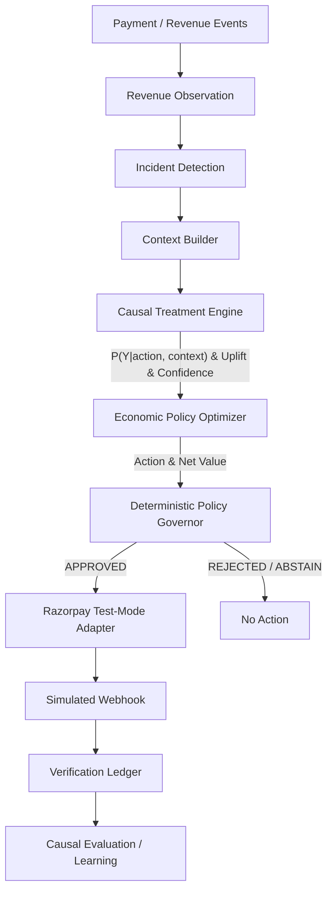

# System Architecture

The CausalRecover system consists of 8 distinct layers that separate estimation from execution.

## Layers

1. **Observation Layer**: Ingests the initial failure case and context.
2. **Causal Intelligence**: Uses T-Learners and Doubly Robust estimators to estimate $P(Y \mid X, A=a)$ and calculates causal uplift.
3. **Economic Decision**: Transforms uplift into expected incremental value (Amount * Uplift - Cost).
4. **Safety / Policy**: A deterministic rules engine that vetoes dangerous actions.
5. **Execution**: A bounded wrapper around the Razorpay Python SDK and MCP tools.
6. **Verification**: Uses webhooks to transition states (Attempted -> Verified).
7. **Measurement**: Offline estimation using Inverse Propensity Weighting (IPW).
8. **Learning**: Feedback loop updating the models.
